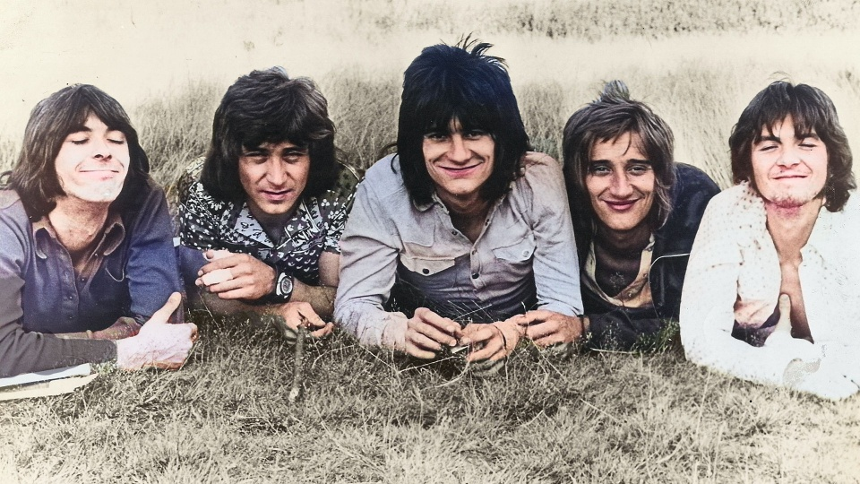
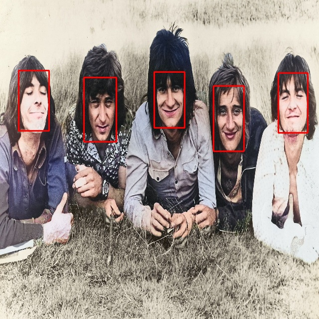

# DeepFaceRecognition
DeepFaceRecognition repository provide an ability to detect faces on images. To use our project follow this instruction.
## Installation
Set a TZ:  
```
$ export TZ=Europe/Moscow && ln -snf /usr/share/zoneinfo/$TZ /etc/localtime && echo $TZ > /etc/timezone
```
Make sure that `make` and `git` is installed in your system:
```
$ apt-get update && apt-get install -y make git
```
```
$ git clone https://github.com/yur1xfd/DeepFaceRecognition.git && cd DeepFaceRecognition
```
You can use our project in 2 ways.
### 1. Build locally with Makefile

Install all dependencies:
```
$ make prereqs
```
### 2. Build with Docker
Build docker image using Dockerfile
```
$ docker build -t deepface .
```
Run builded image
```
$ docker compose up -d
```
Attach to container
```
$ docker attach deepface-service-1
```
## Quick Start
Put images you want to use for face recognition to `input_raw/` folder. To run our DeepFaceRecognition pipeline:  


Build executables
```
$ make build
```
Run preprocessing stage
```
$ make preprocessing
```
Run processing stage
```
$ make processing
```
Run postprocessing stage
```
$ make postprocessing
```
Now you have the results in the `output/` folder.  


Also you can run full pipeline with one command:
```
$ make run
```
Here an example of running our pipline:
   1. Raw input image 
   
   2. Preprocessed image after `make preprocessing` (Resize from 1920x1080 to 960x540)
      
   3. Output image after processing and postprocessing stages
     

Foundations of Software Engineering for AI course final project  
Our team:
1. Ivan Listopadov
2. Sergey Grozny
3. Roman Dyachenko
4. Yurii Melnik
